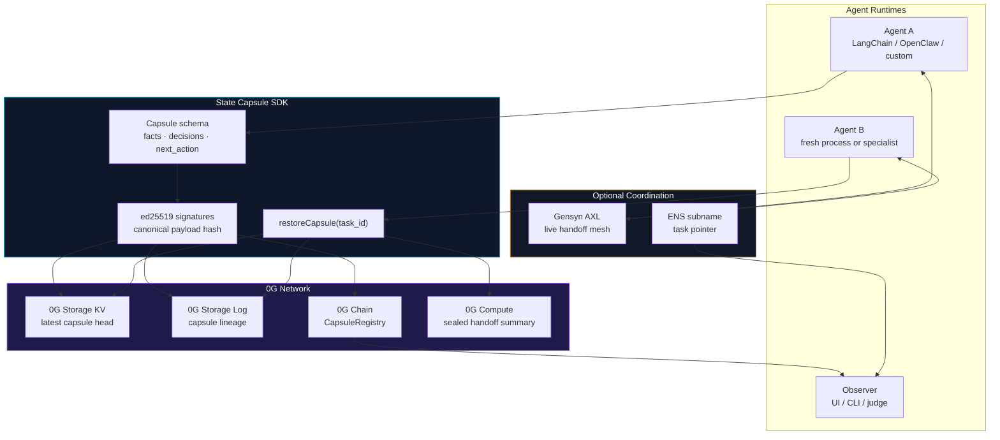
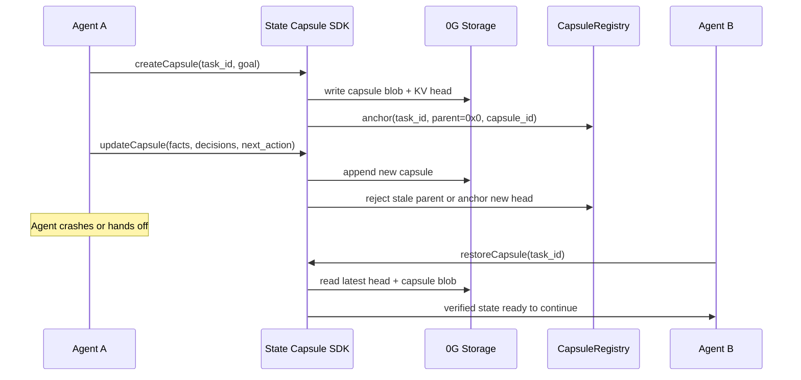
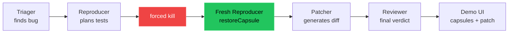

<!-- Header -->
<p align="center">
  
</p>

<p align="center">
  
  
  
  
</p>

<h1 align="center">State Capsule</h1>

<p align="center">
  <strong>Durable state for agent runtimes.</strong><br/>
  <em>Checkpoint work. Verify handoffs. Resume after crashes.</em>
</p>

<p align="center">
  <a href="#quick-start"></a>&nbsp;
  <a href="#architecture"></a>&nbsp;
  <a href="#sdk"></a>&nbsp;
  <a href="#maintainerswarm-demo"></a>&nbsp;
  <a href="#sponsor-integration-depth"></a>
</p>

---

## Table of Contents

- [What Is State Capsule?](#what-is-state-capsule)
- [SDK vs Demo](#sdk-vs-demo)
- [Why It Exists](#why-it-exists)
- [Architecture](#architecture)
- [SDK](#sdk)
- [MaintainerSwarm Demo](#maintainerswarm-demo)
- [Quick Start](#quick-start)
- [Sponsor Integration Depth](#sponsor-integration-depth)
- [Framework Adapters](#framework-adapters)
  - [OpenClaw Adapter](#openclaw-adapter)
  - [LangChain.js Adapter](#langchainjs-adapter)
  - [Vercel AI SDK Adapter](#vercel-ai-sdk-adapter)
- [Repository Layout](#repository-layout)
- [Environment](#environment)
- [Development Commands](#development-commands)

---

## What Is State Capsule?

Agents are getting longer-running, more specialized, and more distributed. But most agent runtimes still treat process death as memory death: if an agent crashes, is reset, or hands work to another specialist, the next process often has to reconstruct the task from chat logs and hope nothing important was lost.

**State Capsule** is a TypeScript SDK and protocol for preserving the executable state of an agent task:

| Primitive | What it captures | Why it matters |
|:----------|:-----------------|:---------------|
| **Capsule** | goal, facts, constraints, decisions, pending actions, next action, holder | A fresh agent can continue from structured state, not raw conversation history |
| **Capsule chain** | signed parent-linked capsule revisions | Every handoff has provenance and tamper evidence |
| **Storage head** | latest capsule pointer in 0G Storage KV | New processes can restore by `task_id` |
| **Log root** | append-only capsule history in 0G Storage Log/blob roots | Observers can inspect the state lineage |
| **Registry anchor** | current capsule head on 0G Chain | Concurrent writers are rejected and stale handoffs are visible |
| **Task pointer** | optional ENS subname exposing live holder/head/status | Humans and agents can resolve task state by name |

State Capsule is **not** a chatbot and not a single demo app. It is the continuity layer underneath agent frameworks.

---

## SDK vs Demo

This repository contains both the protocol implementation and a flagship demo. They are intentionally separate:

| Layer | Name | Purpose |
|:------|:-----|:--------|
| **Product** | `@state-capsule/sdk` | Reusable TypeScript SDK: create, update, restore, verify |
| **Protocol** | Capsule schema + registry + storage layout | Portable state contract for agent handoffs |
| **Integrations** | 0G, Gensyn AXL, ENS, adapters | Durability, coordination, task pointers, framework hooks |
| **Demo** | MaintainerSwarm | A four-agent open-source maintenance swarm built on top of the SDK |
| **UI** | `apps/demo-ui` | Local landing page and live demo dashboard |

**MaintainerSwarm proves the SDK. It is not the SDK.**

---

## Why It Exists

Today, most agent memory systems store what happened. State Capsule stores what must happen next.

When an agent dies mid-task, the replacement needs more than a transcript. It needs:

- the facts already verified,
- the constraints it must not violate,
- the decisions already committed,
- the pending actions still open,
- the current holder of the task,
- and a signed chain proving the state was not invented after the fact.

State Capsule gives agent systems a small, durable handoff primitive that can survive process death, node failure, model replacement, and framework boundaries.

---

## Architecture



### Capsule Lifecycle



---

## SDK

The core package is `packages/state-capsule-sdk`.

```ts
import { StateCapsule, createMemoryStorage } from "@state-capsule/sdk";

const sdk = new StateCapsule({
  storageAdapter: createMemoryStorage(),
});

const genesis = await sdk.createCapsule({
  task_id: "issue-482",
  goal: "Reproduce and fix the failing test",
  holder: "triager",
  facts: ["User reports intermittent timeout in CI"],
  next_action: "classify issue",
});

const next = await sdk.updateCapsule({
  task_id: genesis.task_id,
  parent_capsule_id: genesis.capsule_id,
  holder: "reproducer",
  facts: [...genesis.facts, "Failure appears only under concurrent writes"],
  decisions: ["Move investigation to sandboxed reproducer"],
  next_action: "write minimal failing test",
});

const restored = await sdk.restoreCapsule("issue-482");
console.log(restored.next_action); // "write minimal failing test"

await sdk.verifyHandoff([genesis, next]);
```

### Core API

| Method | Purpose |
|:-------|:--------|
| `createCapsule(input)` | Create the genesis capsule for a task |
| `updateCapsule(input)` | Extend the capsule chain with new actionable state |
| `restoreCapsule(task_id)` | Recover the latest capsule from storage in a fresh process |
| `verifyHandoff(capsules)` | Verify signatures and parent linkage from genesis to tip |
| `bootstrapCapsule(raw)` | Seed a received capsule into local storage/cache |
| `fetchSealedSummary(capsule)` | Produce or fetch a compact handoff summary |

### Capsule Fields

| Field | Meaning |
|:------|:--------|
| `capsule_id` | Content-derived 32-byte capsule identifier |
| `task_id` | Stable ID for the workflow |
| `parent_capsule_id` | Previous capsule head, or `null` for genesis |
| `created_by` / `signature` | ed25519 authorship proof over canonical payload |
| `goal` | Task objective |
| `facts` | Verified observations |
| `constraints` | Invariants future agents must respect |
| `decisions` | Committed choices and rationale references |
| `pending_actions` | Ordered queue of remaining work |
| `next_action` | The immediate next step |
| `holder` | Current agent or role responsible for the task |
| `log_root` | 0G Storage root for the capsule write |
| `task_pointer` | ENS name for human-readable resolution |

---

## MaintainerSwarm Demo

MaintainerSwarm is the flagship proof: a multi-agent open-source maintenance workflow that survives a forced kill.

| Agent | Responsibility | Why it is separate |
|:------|:---------------|:-------------------|
| **Triager** | Classifies the issue and identifies suspicious code | Starts the task and writes the first capsule |
| **Reproducer** | Designs and writes failing tests | Runs untrusted code in a separate failure domain |
| **Patcher** | Produces a concrete source diff | Can use a different model or trust boundary |
| **Reviewer** | Accepts or rejects the patch | Adversarial review should not share patcher state |

### Demo Flow



The important moment is not that a patch is generated. The important moment is that the new Reproducer does **not** start from zero. It restores the capsule written before the kill and continues from the saved next action.

---

## Quick Start

### Prerequisites


```bash
pnpm install
cp .env.example .env
```

At least one LLM key is required for live agent intelligence:

```bash
OPENAI_API_KEY=
ANTHROPIC_API_KEY=
GROQ_API_KEY=
```

0G, ENS, and AXL variables are optional for local development. Without `OG_PRIVATE_KEY`, the SDK falls back to in-memory storage.

### Run the Demo UI

```bash
pnpm demo:ui
```

Open:

```text
http://localhost:3333
```

Use `/demo` to paste a GitHub repository. The UI clones the repo, picks a target source file, starts MaintainerSwarm, and streams the capsule lifecycle.

### Run the Deterministic Demo

```bash
pnpm demo:replay
```

### Record a New Demo Transcript

```bash
STATE_CAPSULE_MODE=record pnpm demo:record
```

### Run Tests

```bash
pnpm test
```

### Run the 0G / AXL / ENS Spikes

```bash
pnpm spike
```

---

## Sponsor Integration Depth

### 0G Network

State Capsule is built as a **framework-level primitive** for 0G agent builders, not just an app that happens to call 0G. The SDK uses the full 0G stack as the durability layer for agent continuity.

| 0G component | What we built | Why it matters |
|:-------------|:--------------|:---------------|
| **0G Storage KV** | Mutable capsule head keyed by `task_id` | Any fresh agent can resolve `task_id -> latest capsule` in one read |
| **0G Storage blobs/logs** | Append-only capsule chain, stored as content-addressed payloads | Every state transition has an auditable provenance trail |
| **0G Chain** | `CapsuleRegistry` anchor with stale-parent rejection | Concurrent writers cannot silently fork task state |
| **0G Compute** | Sealed handoff summary for long capsule chains | A replacement agent can load verified context without replaying the whole log |
| **SDK hooks** | `onAfterUpdate`, storage adapters, chain config, sealed summary API | Other frameworks can adopt the primitive without rewriting their runtime |

Deployed registry:

| Network | Contract | Address |
|:--------|:---------|:--------|
| 0G testnet | `CapsuleRegistry` | `0x0C90470bFf685eFEDc03Ffff5ACBfFebb0D0cd03` |

The core value for 0G: State Capsule turns 0G Storage, Compute, and Chain into a reusable **agent-brain continuity layer**. MaintainerSwarm is the proof that the primitive handles a real multi-agent workflow under failure.

### Gensyn AXL

AXL is the **only live coordination fabric** in MaintainerSwarm. There is no fallback broker in the demo path: State Capsule handles durable state, and AXL handles role-to-role messaging across separate processes.

| AXL surface | Usage |
|:------------|:------|
| **4 separate nodes** | Triager, Reproducer, Patcher, Reviewer each run as their own role/process |
| `/send` / `/recv` | Capsule handoff signals and coordination messages |
| `/a2a/` | Structured task assignment between specialists |
| GossipSub | Live broadcast of capsule update events |
| `/mcp/` | Tool exposure path for sandbox/test helpers such as run-tests, git-diff, search-codebase |

Why AXL is not decorative here:

- The Reproducer needs sandbox isolation because it runs untrusted target code.
- The Reviewer should be independent from the Patcher to provide adversarial signal.
- Specialists may use different model providers or trust domains.
- Killing an agent should not destroy the task; a replacement restores from State Capsule and rejoins the AXL mesh.

Remove AXL and the live swarm cannot coordinate. Remove State Capsule and the swarm cannot recover.

### ENS

ENS is used as a **live state primitive**, not an identity card.

Every task can publish a subname such as `task-<short-id>.maintainerswarm.eth`. Its text records mirror the current capsule state:

| Record | Meaning |
|:-------|:--------|
| `capsule.head` | Latest capsule ID |
| `capsule.holder` | Current task holder |
| `capsule.log_root` | Latest storage/log root |
| `capsule.status` | Active, held, or done |

That makes the kill-and-resume moment observable with normal resolver tooling:

```text
capsule.holder = reproducer     # before crash recovery
capsule.status = held

capsule.holder = reproducer-2   # after fresh process restores and claims task
capsule.status = active
```

The ENS package also includes delegation-subname helpers: a current holder can issue a single-use child subname carrying a capsule reference and expiry. Revocation is modeled as burning or invalidating the subname. If ENS or NameStone is unavailable, the SDK degrades gracefully and the capsule write still succeeds.

---

## Framework Adapters

Adapters are what make State Capsule a framework primitive instead of a bespoke demo runtime. Each adapter exposes a small integration point that checkpoints the framework's existing execution loop into signed capsules.

| Adapter | Package | Integration point | What gets checkpointed |
|:--------|:--------|:------------------|:-----------------------|
| **OpenClaw** | `@state-capsule/adapter-openclaw` | `createStateCapsuleMemory()` memory backend | Markdown memory sections become capsule facts, decisions, pending actions, and next action |
| **LangChain.js** | `@state-capsule/adapter-langchain` | `StateCapsuleMemory` + `withCapsuleMemory()` Runnable wrapper | Chain inputs/outputs and restored capsule context |
| **Vercel AI SDK** | `@state-capsule/adapter-vercel-ai` | `onStepFinish` middleware for `generateText` / `streamText` | Step text, tool calls, finish reason, continued state |
| **LlamaIndex** | planned | Memory backend | Capsule-backed task memory |

### OpenClaw Adapter

OpenClaw memory flush:

```ts
const memory = createStateCapsuleMemory(sdk, {
  taskId: "session-abc",
  holder: "assistant",
});

const context = await memory.read();
await memory.write(context + "\n## Facts\n- user prefers TypeScript");
```

### LangChain.js Adapter

LangChain Runnable wrapper:

```ts
const memory = new StateCapsuleMemory(sdk, {
  taskId: "fix-bug-42",
  holder: "agent",
});

const wrapped = withCapsuleMemory(chain, memory);
const result = await wrapped.invoke({ input: "What's next?" });
```

### Vercel AI SDK Adapter

Vercel AI SDK step checkpoint:

```ts
const middleware = createCapsuleMiddleware(sdk, {
  taskId: "patch-pr-99",
  holder: "agent",
});

await generateText({
  model,
  prompt: "Fix the failing tests.",
  onStepFinish: middleware.onStepFinish,
});
```

The adapter goal is intentionally boring: add continuity to existing agent code with one memory object or one callback, then let the SDK handle signing, storage, restoration, and verification.

---

## Repository Layout

```text
state-capsule/
├── apps/
│   └── demo-ui/                     # Landing page + live demo dashboard
├── packages/
│   ├── state-capsule-sdk/           # Core SDK
│   ├── state-capsule-contracts/     # CapsuleRegistry.sol
│   ├── state-capsule-ens/           # ENS task pointers + delegations
│   └── state-capsule-adapters/      # OpenClaw, LangChain, Vercel AI SDK
├── examples/
│   ├── maintainer-swarm/            # Triager/Reproducer/Patcher/Reviewer demo
│   ├── buggy-utils/                 # Seeded local target repo
│   └── adapters/                    # Small adapter examples
├── infra/                           # Docker/AXL demo infrastructure
├── scripts/                         # Smoke, record, replay, spike scripts
├── prd.md                           # Product requirements and sponsor narrative
└── IMPLEMENTATION.md                # Hackathon build plan
```

---

## Environment

Important variables from `.env.example`:

| Variable | Required | Purpose |
|:---------|:---------|:--------|
| `OPENAI_API_KEY` / `ANTHROPIC_API_KEY` / `GROQ_API_KEY` | one required for live mode | Agent intelligence |
| `STATE_CAPSULE_MODE` | optional | `live`, `record`, or `replay` |
| `OG_PRIVATE_KEY` | optional | Enables real 0G Storage and chain writes |
| `OG_EVM_RPC` | optional | 0G Chain RPC |
| `OG_INDEXER_RPC` | optional | 0G Storage indexer |
| `OG_COMPUTE_SERVICE_URL` | optional | 0G Compute provider endpoint |
| `NAMESTONE_API_KEY` | optional | ENS task pointer publishing |
| `ENS_PARENT_NAME` | optional | Parent name for task subnames |
| `AXL_BINARY_PATH` | optional | Local AXL node binary |

---

## Development Commands

```bash
pnpm --filter @state-capsule/sdk test
pnpm --filter @state-capsule/maintainer-swarm typecheck
pnpm --filter @state-capsule/demo-ui build
pnpm demo:smoke
pnpm demo:ui
```

---

## Status


This project is an active hackathon build. The core continuity primitive is implemented, the MaintainerSwarm demo is live, and integrations are designed to degrade gracefully when external testnet services are unavailable.

---

## License

No license file has been added yet.
